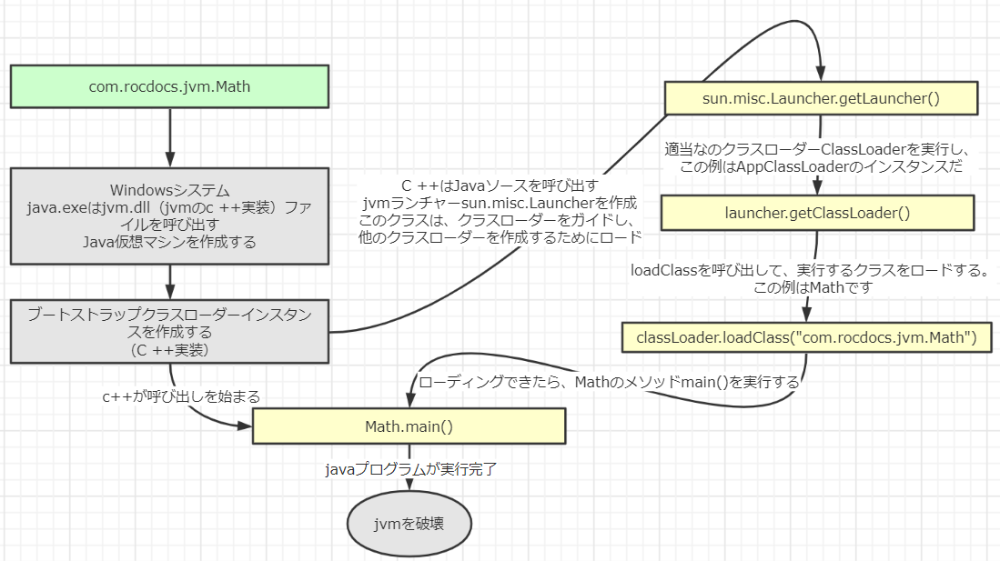
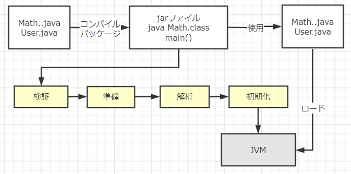
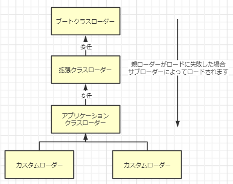
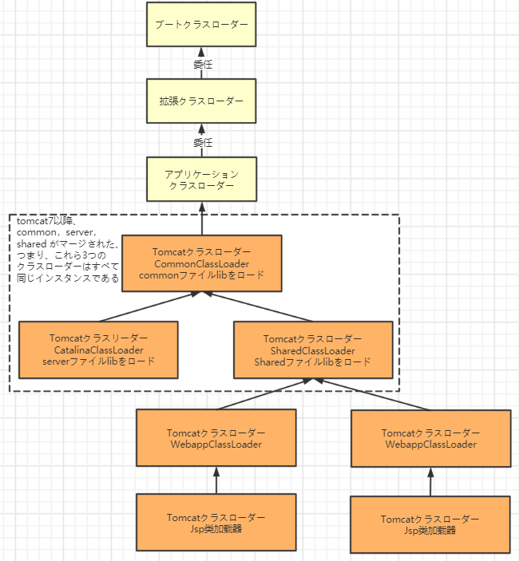

# JDKソースコードレベルからのJVMクラスロードメカニズムの徹底的な分析
## クラスのロードと実行のプロセス全体

javaコマンドを使用して特定のクラスのメイン関数を実行してプログラムを開始する場合、最初にクラスローダーを介してメインクラスをJVMにロードする必要があります。

```java:Math.java
package com.rocdocs.jvm;

public class Math {
    public static final int initData = 666;
    public static User user = new User();

    public int compute() {  //各メソッドは、スタックフレームメモリ（領域）に対応します。
        int a = 1;
        int b = 2;
        int c = (a + b) * 10;
        return c;
    }

    public static void main(String[] args) {
        Math math = new Math();
        math.compute();
    }

}
```

Javaコマンドを使用してコードを実行する一般的なプロセスは下図のとおりです：



loadClassのクラス読み込みプロセスには、次の手順があります：

ロード>>検証>>準備>>分析>>初期化>>使用>>アンインストール

* ロード：ハードディスク上でバイトコードファイルを見つけ、IOを介して読み取ります。クラスのmain（）メソッド、新しいオブジェクトなど、およびこのクラスの代表を呼び出すなど、クラスが使用されるときにロードされます。ロードフェーズ中にメモリに生成されますjava.lang.Classオブジェクトは、メソッド領域でこのクラスのさまざまなデータのアクセスエントリとして使用されます。

* 検証：バイトコードファイルの正確さを検証します。

* 準備：クラスの静的変数にメモリを割り当て、デフォルト値を割り当てます。

* 解決策：シンボリック参照を直接参照に置き換えます。この段階で、一部の静的メソッド（main（）メソッドなどのシンボル参照）は、データが格納されているメモリへのポインターまたはハンドル（直接参照）に置き換えられます。いわゆる静的リンクプロセス（クラスのロード中に完了）、動的リンクはプログラムの実行中に実行され、シンボル参照を直接参照に置き換えます。動的リンクについては、次のレッスンで説明します。

* 初期化：クラスの静的変数を指定された値に初期化し、静的コードブロックを実行します。



クラスがメソッド領域にロードされると、主にランタイム定数プール、タイプ情報、フィールド情報、メソッド情報、クラスローダーへの参照、対応するクラスインスタンスへの参照およびその他の情報が含まれます。

クラスローダー参照：このクラスのクラスローダーインスタンスへの参照

対応するクラスインスタンスへの参照：クラスローダーがクラス情報をロードしてメソッド領域に配置した後、対応するクラスタイプのオブジェクトインスタンスを作成し、開発者のエントリおよびエントリとしてヒープ（ヒープ）に配置します。メソッド領域エントリポイントのクラス定義にアクセスします。

動作中にメインクラスで他のクラスが使用されている場合、これらのクラスは徐々にロードされることに注意してください。

jarパッケージまたはwarパッケージのクラスは、一度にロードされるのではなく、使用されたときにのみロードされます。

``` java
public class DynamicLoadTest {

    static {
        System.out.println("------------load DynamicLoadTest------------");
    }

    public static void main(String[] args) {
        new A();
        System.out.println("------------*load test------------");
        B b = null;  //ここで新しいB（）が実行されない限り、Bはロードされません。
    }
}

class A {
    static {
        System.out.println("------------load A------------");
    }

    public A() {
        System.out.println("------------initial A------------");
    }
}

class B {
    static {
        System.out.println("------------load B------------");
    }

    public B() {
        System.out.println("------------initial B------------");
    }
}
```

実行結果：
```terminal
------------load DynamicLoadTest------------
------------load A------------
------------initial A------------
------------load test------------
``` 

## クラス​ローダーと委任モデル

上記のクラスロードプロセスは、主にクラスローダーを介して実現されます。Javaには次のタイプのクラスローダーがあります。

* ブートクラスローダー：rt.jar、charsets.jarなどのJVM操作をサポートするJREのlibディレクトリにコアクラスライブラリをロードする役割を果たします。

* 拡張クラスローダー：JVM操作をサポートするJREのlibディレクトリの下のext拡張ディレクトリにJARパッケージのロードを担当します。

* アプリケーションクラスローダー：ClassPathパスでクラスパッケージをロードし、主に自分で作成したクラスをロードします。

* カスタムローダー：ユーザー定義のパスでクラスパッケージのロードを担当します。

クラスローダーの例を見ましょう。

```java:JDKClassLoaderTest.java
public class JDKClassLoaderTest {

    public static void main(String[] args) {
        System.out.println(String.class.getClassLoader());
        System.out.println(com.sun.crypto.provider.DESKeyFactory.class.getClassLoader().getClass().getName());
        System.out.println(JDKClassLoaderTest.class.getClassLoader().getClass().getName());

        System.out.println();
        ClassLoader appClassLoader = ClassLoader.getSystemClassLoader();
        ClassLoader extClassloader = appClassLoader.getParent();
        ClassLoader bootstrapLoader = extClassloader.getParent();
        System.out.println("the bootstrapLoader : " + bootstrapLoader);
        System.out.println("the extClassloader : " + extClassloader);
        System.out.println("the appClassLoader : " + appClassLoader);

        System.out.println();
        System.out.println("bootstrapLoaderは下記のファイルをロード：");
        URL[] urls = Launcher.getBootstrapClassPath().getURLs();
        for (int i = 0; i < urls.length; i++) {
            System.out.println(urls[i]);
        }

        System.out.println();
        System.out.println("extClassloaderは下記のファイルをロード：");
        System.out.println(System.getProperty("java.ext.dirs"));

        System.out.println();
        System.out.println("appClassLoadeは下記のファイルをロード：");
        System.out.println(System.getProperty("java.class.path"));

    }
}
```

実行結果：
```
null
sun.misc.Launcher$ExtClassLoader
sun.misc.Launcher$AppClassLoader

the bootstrapLoader : null
the extClassloader : sun.misc.Launcher$ExtClassLoader@3764951d
the appClassLoader : sun.misc.Launcher$AppClassLoader@14dad5dc

bootstrapLoaderは下記のファイルをロード：
file:/D:/dev/Java/jdk1.8.0_45/jre/lib/resources.jar
file:/D:/dev/Java/jdk1.8.0_45/jre/lib/rt.jar
file:/D:/dev/Java/jdk1.8.0_45/jre/lib/sunrsasign.jar
file:/D:/dev/Java/jdk1.8.0_45/jre/lib/jsse.jar
file:/D:/dev/Java/jdk1.8.0_45/jre/lib/jce.jar
file:/D:/dev/Java/jdk1.8.0_45/jre/lib/charsets.jar
file:/D:/dev/Java/jdk1.8.0_45/jre/lib/jfr.jar
file:/D:/dev/Java/jdk1.8.0_45/jre/classes

extClassloaderは下記のファイルをロード：
c:\workspace\java\jdk1.8.0_45\jre\lib\ext;c:\java\lib\ext

appClassLoaderは下記のファイルをロード：
c:\workspace\java\jdk1.8.0_45\jre\lib\charsets.jar;c:\workspace\java\jdk1.8.0_45\jre\lib\deploy.jar;c:\workspace\java\jdk1.8.0_45\jre\lib\ext\access-bridge-64.jar;c:\workspace\java\jdk1.8.0_45\jre\lib\ext\cldrdata.jar;c:\workspace\java\jdk1.8.0_45\jre\lib\ext\dnsns.jar;c:\workspace\java\jdk1.8.0_45\jre\lib\ext\jaccess.jar;c:\workspace\java\jdk1.8.0_45\jre\lib\ext\jfxrt.jar;c:\workspace\java\jdk1.8.0_45\jre\lib\ext\localedata.jar;c:\workspace\java\jdk1.8.0_45\jre\lib\ext\nashorn.jar;c:\workspace\java\jdk1.8.0_45\jre\lib\ext\sunec.jar;c:\workspace\java\jdk1.8.0_45\jre\lib\ext\sunjce_provider.jar;c:\workspace\java\jdk1.8.0_45\jre\lib\ext\sunmscapi.jar;c:\workspace\java\jdk1.8.0_45\jre\lib\ext\sunpkcs11.jar;c:\workspace\java\jdk1.8.0_45\jre\lib\ext\zipfs.jar;c:\workspace\java\jdk1.8.0_45\jre\lib\javaws.jar;c:\workspace\java\jdk1.8.0_45\jre\lib\jce.jar;c:\workspace\java\jdk1.8.0_45\jre\lib\jfr.jar;c:\workspace\java\jdk1.8.0_45\jre\lib\jfxswt.jar;c:\workspace\java\jdk1.8.0_45\jre\lib\jsse.jar;c:\workspace\java\jdk1.8.0_45\jre\lib\management-agent.jar;c:\workspace\java\jdk1.8.0_45\jre\lib\plugin.jar;c:\workspace\java\jdk1.8.0_45\jre\lib\resources.jar;c:\workspace\java\jdk1.8.0_45\jre\lib\rt.jar;D:\ideaProjects\project-all\target\classes;C:\Users\zhuge\.m2\repository\org\apache\zookeeper\zookeeper\3.4.12\zookeeper-3.4.12.jar;C:\Users\zhuge\.m2\repository\org\slf4j\slf4j-api\1.7.25\slf4j-api-1.7.25.jar;C:\Users\zhuge\.m2\repository\org\slf4j\slf4j-log4j12\1.7.25\slf4j-log4j12-1.7.25.jar;C:\Users\zhuge\.m2\repository\log4j\log4j\1.2.17\log4j-1.2.17.jar;C:\Users\zhuge\.m2\repository\jline\jline\0.9.94\jline-0.9.94.jar;C:\Users\zhuge\.m2\repository\org\apache\yetus\audience-annotations\0.5.0\audience-annotations-0.5.0.jar;C:\Users\zhuge\.m2\repository\io\netty\netty\3.10.6.Final\netty-3.10.6.Final.jar;C:\Users\zhuge\.m2\repository\com\google\guava\guava\22.0\guava-22.0.jar;C:\Users\zhuge\.m2\repository\com\google\code\findbugs\jsr305\1.3.9\jsr305-1.3.9.jar;C:\Users\zhuge\.m2\repository\com\google\errorprone\error_prone_annotations\2.0.18\error_prone_annotations-2.0.18.jar;C:\Users\zhuge\.m2\repository\com\google\j2objc\j2objc-annotations\1.1\j2objc-annotations-1.1.jar;C:\Users\zhuge\.m2\repository\org\codehaus\mojo\animal-sniffer-annotations\1.14\animal-sniffer-annotations-1.14.jar;D:\dev\IntelliJ IDEA 2018.3.2\lib\idea_rt.jar

```

## クラスローダーの初期化プロセス
クラスの実行とロードのプロセス全体の図を参照して、JVMランチャーインスタンスsun.misc.Launcherが作成されることが分かります。

Launcher構築メソッド内に、sun.misc.Launcher.ExtClassLoader（拡張クラスローダー）とsun.misc.Launcher.AppClassLoader（アプリケーションクラスローダー）の2つのクラスローダーが作成されます。

デフォルトでは、JVMはLauncherのgetClassLoader（）メソッドによって返されるクラスローダーAppClassLoaderのインスタンスを使用して、アプリケーションをロードします。

```java
//Launcherのコンストラクタ
public Launcher() {
    Launcher.ExtClassLoader var1;
    try {
        //拡張クラスローダーを構築し、構築プロセス中にその親ローダーをnullに設定する
        var1 = Launcher.ExtClassLoader.getExtClassLoader();
    } catch (IOException var10) {
        throw new InternalError("Could not create extension class loader", var10);
    }

    try {
        //アプリケーションクラスローダーを構築し、構築プロセス中にその親ローダーをExtClassLoaderに設定する。
        //Launcherのローダー属性値はAppClassLoaderです。通常、このクラスローダーを使用して独自のアプリケーションをロードする。
        this.loader = Launcher.AppClassLoader.getAppClassLoader(var1);
    } catch (IOException var9) {
        throw new InternalError("Could not create application class loader", var9);
    }

    Thread.currentThread().setContextClassLoader(this.loader);
    String var2 = System.getProperty("java.security.manager");
    
    ...... //気にする必要のないコードは省略

}
```

## 委任モデル

以下に示すように、JVMクラスローダーには親子階層があります。



実際には、クラスをロードするための親委任メカニズムがあります。特定のクラスをロードするとき、最初に親ローダーにターゲットクラスの検索を委託し、次に、上位の親ローダーが見つからない場合は読み込みを委託します。すべての親ローダーが独自のロードクラスパス内ターゲットクラスが見つからない場合は、独自のクラスロードパス内のターゲットクラスを検索してロードします。

たとえば、Mathクラスは最初にロードするアプリケーションクラスローダーを見つけ、アプリケーションクラスローダーは最初に拡張クラスローダーにロードを委託し、次に拡張クラスローダーはブートクラスローダーに委託し、トップレベルのブートクラスローダーは独自のクラスロードパスを長時間検索し、Mathクラスが見つからなかった場合、Mathクラスをロードする要求に戻り、拡張クラスローダーは応答を受信した後に自身をロードします。独自のクラスで検索した後長い間パスをロードしていると、Mathクラスが見つかりません。アプリケーションクラスローダーへのMathクラスのロード要求に戻ると、アプリケーションクラスローダーは独自のクラスロードパスでMathクラスを探し、ロードします。それが見つかるとそれ自体。 

一言で、委任モデルとは、先ずは親クラスローダーがロードする、失敗だったら、子クラスローダーがロードすることである。

アプリケーションクラスローダーAppClassLoaderローディングクラスの親委任メカニズムのソースコードを見てみましょう。AppClassLoaderのloadClassメソッドは、最終的にその親クラスClassLoaderのloadClassメソッドを呼び出します。メソッドの一般的なロジックは次のとおりです。

1. まず、指定した名前のクラスがロードされているかどうかを確認します。ロードされている場合は、再度ロードして直接戻る必要はありません。

2. このクラスがロードされていない場合は、親ローダーがあるかどうかを判断します。親ローダーがある場合は、親ローダーによってロードされます（つまり、parent.loadClass（name、false）;を呼び出します）。または、ブートストラップクラスローダーを呼び出してロードします。

3. 親ローダーもブートストラップクラスローダーも指定されたクラスを見つけられない場合は、現在のクラスローダーのfindClassメソッドを呼び出して、クラスのロードを完了します。

```java
//委任モデルがClassLoaderのloadClassメソッドで実現された
protected Class<?> loadClass(String name, boolean resolve)
    throws ClassNotFoundException
{
    synchronized (getClassLoadingLock(name)) {
        // 現在のクラスローダーがクラスをロードしたかどうかを確認する
        Class<?> c = findLoadedClass(name);
        if (c == null) {
            long t0 = System.nanoTime();
            try {
                if (parent != null) {  //現在のローダーの親ローダーが空でない場合は、親ローダーを委任してクラスをロードする
                    c = parent.loadClass(name, false);
                } else {  //現在のローダーの親ローダーが空の場合は、ブートクラスローダーを委任してクラスをロードする
                    c = findBootstrapClassOrNull(name);
                }
            } catch (ClassNotFoundException e) {
                // ClassNotFoundException thrown if class not found
                // from the non-null parent class loader
            }

            if (c == null) {
                // If still not found, then invoke findClass in order
                // to find the class.
                long t1 = System.nanoTime();
                //URLClassLoaderのfindClassメソッドを呼び出して、ローダーのクラスパスでクラスを検索してロードする
                c = findClass(name);

                // this is the defining class loader; record the stats
                sun.misc.PerfCounter.getParentDelegationTime().addTime(t1 - t0);
                sun.misc.PerfCounter.getFindClassTime().addElapsedTimeFrom(t1);
                sun.misc.PerfCounter.getFindClasses().increment();
            }
        }
        if (resolve) {
            resolveClass(c);
        }
        return c;
    }
}
```

**なぜ親委任メカニズムを設計するのですか？**

+ サンドボックスのセキュリティメカニズム：自分で作成したjava.lang.String.classは読み込まれないため、コアAPIライブラリが自由に改ざんされるのを防ぐことができます。

+ クラスの繰り返しロードを回避します。父親がすでにクラスをロードしている場合、ロードされたクラスの一意性を確保するために子ClassLoaderを再度ロードする必要はありません。

クラスの読み込みの例を見てください。

```java
package java.lang;

public class String {
    public static void main(String[] args) {
        System.out.println("------------My String Class------------");
    }
}
```

実行結果：
```
Error: The main method cannot be found in the class java.lang.String, please define the main method as:
    public static void main(String[] args)
Otherwise the JavaFX application class must extend javafx.application.Application
```

## 委任モデルの全責任

「**全責任**」とは、ClassLoderがクラスをロードするときに、別のClassLoderが明示的に使用されていない限り、クラスが依存し参照するクラスもこのClassLoderによってロードされることを意味します。

**カスタムクラスローダーの例**

カスタムクラスローダーは、java.lang.ClassLoaderクラスを継承するだけで済みます。このクラスには、**委任モデル**を実装するloadClass（String、boolean）とデフォルトの実装であるfindClassの2つのコアメソッドがあります。空のメソッドなので、カスタムクラスローダーは主に**findClassメソッドをオーバーライドする**ことです。

```java
public class MyClassLoaderTest {
    static class MyClassLoader extends ClassLoader {
        private String classPath;

        public MyClassLoader(String classPath) {
            this.classPath = classPath;
        }

        private byte[] loadByte(String name) throws Exception {
            name = name.replaceAll("\\.", "/");
            FileInputStream fis = new FileInputStream(classPath + "/" + name
                    + ".class");
            int len = fis.available();
            byte[] data = new byte[len];
            fis.read(data);
            fis.close();
            return data;
        }

        protected Class<?> findClass(String name) throws ClassNotFoundException {
            try {
                byte[] data = loadByte(name);
                //defineClassは、バイト配列をClassオブジェクトに変換します。このバイト配列は、クラスファイルを読み取った後の最後のバイト配列です。
                return defineClass(name, data, 0, data.length);
            } catch (Exception e) {
                e.printStackTrace();
                throw new ClassNotFoundException();
            }
        }

    }

    public static void main(String args[]) throws Exception {
        //カスタムクラスローダーを初期化するには、最初に親クラスClassLoaderが初期化され、カスタムクラスローダーの親ローダーがアプリケーションクラスローダーAppClassLoaderに設定されます。
        MyClassLoader classLoader = new MyClassLoader("c:/workspace/test");
        Class clazz = classLoader.loadClass("com.rocdocs.jvm.User1");
        Object obj = clazz.newInstance();
        Method method = clazz.getDeclaredMethod("sout", null);
        method.invoke(obj, null);
        System.out.println(clazz.getClassLoader().getClass().getName());
    }
}
```

実行結果：
```
=======カスタムローダーローディングクラス呼び出しメソッド=======
com.rocdocs.jvm.MyClassLoaderTest$MyClassLoader
```

**委任モデルを破る**

サンドボックスセキュリティメカニズムの別の例を見てみましょう。親委任メカニズムを解除し、カスタムクラスローダーを使用してjava.lang.String.classの独自の実装をロードしてみてください。

```java
public class MyClassLoaderTest {
    static class MyClassLoader extends ClassLoader {
        private String classPath;

        public MyClassLoader(String classPath) {
            this.classPath = classPath;
        }

        private byte[] loadByte(String name) throws Exception {
            name = name.replaceAll("\\.", "/");
            FileInputStream fis = new FileInputStream(classPath + "/" + name
                    + ".class");
            int len = fis.available();
            byte[] data = new byte[len];
            fis.read(data);
            fis.close();
            return data;
        }

        protected Class<?> findClass(String name) throws ClassNotFoundException {
            try {
                byte[] data = loadByte(name);
                return defineClass(name, data, 0, data.length);
            } catch (Exception e) {
                e.printStackTrace();
                throw new ClassNotFoundException();
            }
        }

        /**
         * クラスのロードメソッドをオーバーライドし、独自のロードロジックを実装し、ロードを親に委任しないでください
         * @param name
         * @param resolve
         * @return
         * @throws ClassNotFoundException
         */
        protected Class<?> loadClass(String name, boolean resolve)
                throws ClassNotFoundException {
            synchronized (getClassLoadingLock(name)) {
                // First, check if the class has already been loaded
                Class<?> c = findLoadedClass(name);

                if (c == null) {
                    // If still not found, then invoke findClass in order
                    // to find the class.
                    long t1 = System.nanoTime();
                    c = findClass(name);

                    // this is the defining class loader; record the stats
                    sun.misc.PerfCounter.getFindClassTime().addElapsedTimeFrom(t1);
                    sun.misc.PerfCounter.getFindClasses().increment();
                }
                if (resolve) {
                    resolveClass(c);
                }
                return c;
            }
        }
    }

    public static void main(String args[]) throws Exception {
        MyClassLoader classLoader = new MyClassLoader("c:/workspace/test");
        //自分でクラスロードメカニズムを書き直して、自分で作成したjava.lang.String.classをロードしてみてください
        Class clazz = classLoader.loadClass("java.lang.String");
        Object obj = clazz.newInstance();
        Method method= clazz.getDeclaredMethod("sout", null);
        method.invoke(obj, null);
        System.out.println(clazz.getClassLoader().getClass().getName());
    }
}
```

実行結果：
```
java.lang.SecurityException: Prohibited package name: java.lang
	at java.lang.ClassLoader.preDefineClass(ClassLoader.java:659)
	at java.lang.ClassLoader.defineClass(ClassLoader.java:758)
```

**Tomcatのクラスローダーは委任モデルですか**

例としてTomcatクラスのロードを取り上げます。Tomcatがデフォルトの親委任クラスのロードメカニズムを使用している場合、それは機能しますか？

考えてみましょう。TomcatはWebコンテナなので、どのような問題が解決しないといけないでしょうか。

1. Webコンテナは、2つのアプリケーションをデプロイする必要がある場合があります。異なるアプリケーションは、同じサードパーティクラスライブラリの異なるバージョンに依存する場合があります。同じクラスライブラリが同じサーバー上に1つのコピーしかない必要はありません。したがって、次のことを行う必要があります。各アプリケーションクラスライブラリが独立していることを確認し、相互に分離します。

2. 同じWebコンテナにデプロイされた同じクラスライブラリの同じバージョンを共有できます。 それ以外の場合、サーバーに10個のアプリケーションがある場合は、同じクラスライブラリの10個のコピーを仮想マシンにロードする必要があります。

3. Webコンテナには、独自の依存クラスライブラリもあります。これをアプリケーションクラスライブラリと混同しないでください。 セキュリティ上の考慮事項に基づいて、コンテナのクラスライブラリはプログラムのクラスライブラリから分離する必要があります。

4. Webコンテナはjspの変更をサポートする必要があります。仮想マシンで実行する前にjspファイルをクラスファイルにコンパイルする必要があることはわかっています。ただし、プログラムの実行後にjspを変更するのが一般的です。Webコンテナ再起動せずにjspの変更をサポートする必要があります。

もう一度質問を見てみましょう。Tomcatはデフォルトのロード委任モデルを使用できますか？

答えはいいえだ。 どうして？

第１点は、デフォルトのクラスローダーメカニズムを使用する場合、同じクラスライブラリの2つの異なるバージョンをロードできないことです。デフォルトのクラス加算器は、バージョンに関係なく、完全修飾クラス名のみを考慮します。 1つだけです。

2番目は、デフォルトのクラスローダーが達成可能であるということです。これは、その責任が一意性を確保することであるためです。

3番目は最初の質問と同じです。

4番目をもう一度見てみましょう。jspファイルのホットロードを実現する方法を考えます。jspファイルは実際にはクラスファイルです。変更されてもクラス名が同じである場合、クラスローダーは直接既存のメソッド領域はい、変更されたjspは再ロードされません。 じゃあ何をすればいいの？ このjspファイルのクラスローダーを直接アンロードできるので、各jspファイルが一意のクラスローダーに対応していると考えておく必要があります。jspファイルが変更されると、jspクラスローダーが直接アンロードされます。 クラスローダーを再作成し、jspファイルをリロードします。

**Tomcatカスタムローダーの詳細な説明**



Tomcatのいくつかの主要なクラスローダー：

* commonLoader：Tomcatの最も基本的なクラスローダーであるロードパスのクラスには、Tomcatコンテナ自体と各Webappからアクセスできます。

* catalinaLoader：Tomcatコンテナのプライベートクラスローダー。ロードパスのクラスはWebappに表示されません。

* sharedLoader：各Webappによって共有されるクラスローダー。ロードパス内のクラスはすべてのWebappに表示されますが、Tomcatコンテナには表示されません。

* WebappClassLoader：各Webappプライベートクラスローダー、ロードパス内のクラスは、warパッケージ内の関連クラスのロードなど、現在のWebappにのみ表示されます。各warパッケージアプリケーションには、異なる戦争などの相互分離を実現するための独自のWebappClassLoaderがあります。パッケージアプリケーションはさまざまなSpringバージョンを導入しているため、実装はそれぞれのSpringバージョンをロードできます。

これは、図の委任関係からわかります。

CommonClassLoaderがロードできるクラスは、CatalinaClassLoaderとSharedClassLoaderで使用できるため、パブリッククラスライブラリの共有が実現されますが、CatalinaClassLoaderとSharedClassLoaderがロードできるクラスは互いに分離されています。

WebAppClassLoaderは、SharedClassLoaderにロードされたクラスを使用できますが、WebAppClassLoaderの各インスタンスは互いに分離されています。

JasperLoaderのロード範囲は、このJSPファイルによってコンパイルされた.Classファイルのみです。その目的は破棄されます。WebコンテナがJSPファイルが変更されたことを検出すると、JasperLoaderの現在のインスタンスを置き換えます。ホットロードJSPファイルの機能は、新しいJspクラスローダーを作成することで実現されます。

tomcatは、Javaが推奨する親委任モデルに違反していますか？ 答えは：違反です。

明らかに、tomcatはこの方法で実装されていません。分離を実現するために、tomcatはこの規則に従いません。**各webappClassLoaderは、独自のディレクトリにクラスファイルをロードし、親クラスローダーに渡さないため、委任モデルが無効になります**。

**TomcatのwebappClassLoaderの実現をシミュレートして、独自のwarパッケージをロードします。アプリケーション内の異なるバージョンのクラスは、相互の共存と分離を実現します。**

```java
public class MyClassLoaderTest {
    static class MyClassLoader extends ClassLoader {
        private String classPath;

        public MyClassLoader(String classPath) {
            this.classPath = classPath;
        }

        private byte[] loadByte(String name) throws Exception {
            name = name.replaceAll("\\.", "/");
            FileInputStream fis = new FileInputStream(classPath + "/" + name
                    + ".class");
            int len = fis.available();
            byte[] data = new byte[len];
            fis.read(data);
            fis.close();
            return data;

        }

        protected Class<?> findClass(String name) throws ClassNotFoundException {
            try {
                byte[] data = loadByte(name);
                return defineClass(name, data, 0, data.length);
            } catch (Exception e) {
                e.printStackTrace();
                throw new ClassNotFoundException();
            }
        }

        /**
         * クラスのロードメソッドをオーバーライドし、独自のロードロジックを実装し、ロードを親に委任しないにする
         * @param name
         * @param resolve
         * @return
         * @throws ClassNotFoundException
         */
        protected Class<?> loadClass(String name, boolean resolve)
                throws ClassNotFoundException {
            synchronized (getClassLoadingLock(name)) {
                // First, check if the class has already been loaded
                Class<?> c = findLoadedClass(name);

                if (c == null) {
                    // If still not found, then invoke findClass in order
                    // to find the class.
                    long t1 = System.nanoTime();

                    //カスタマイズされていないクラスは、委任された親によって引き続き読み込まれます
                    if (!name.startsWith("com.rocdocs.jvm")){
                        c = this.getParent().loadClass(name);
                    }else{
                        c = findClass(name);
                    }

                    // this is the defining class loader; record the stats
                    sun.misc.PerfCounter.getFindClassTime().addElapsedTimeFrom(t1);
                    sun.misc.PerfCounter.getFindClasses().increment();
                }
                if (resolve) {
                    resolveClass(c);
                }
                return c;
            }
        }
    }

    public static void main(String args[]) throws Exception {
        MyClassLoader classLoader = new MyClassLoader("c:/workspace/test");
        Class clazz = classLoader.loadClass("com.rocdocs.jvm.User1");
        Object obj = clazz.newInstance();
        Method method= clazz.getDeclaredMethod("sout", null);
        method.invoke(obj, null);
        System.out.println(clazz.getClassLoader());
        
        System.out.println();
        MyClassLoader classLoader1 = new MyClassLoader("c:/workspace/test1");
        Class clazz1 = classLoader1.loadClass("com.rocdocs.jvm.User1");
        Object obj1 = clazz1.newInstance();
        Method method1= clazz1.getDeclaredMethod("sout", null);
        method1.invoke(obj1, null);
        System.out.println(clazz1.getClassLoader());
    }
}
```

実行結果：
```
=======カスタムローダーローディングクラス呼び出しメソッド=======
com.rocdocs.jvm.MyClassLoaderTest$MyClassLoader@266474c2

=======別のUser1バージョン：カスタムローダーローディングクラス呼び出しメソッド=======
com.rocdocs.jvm.MyClassLoaderTest$MyClassLoader@66d3c617
```

**注**：同じJVMでは、クラスローダーが異なる可能性があるため、同じパッケージ名とクラス名を持つ2つのクラスオブジェクトが共存できます。したがって、クラスパッケージInを除いて、2つのクラスオブジェクトが同じであるかどうかを確認してください。名前とクラス名が同じであるかどうかに加えて、同じと見なされるには、同じクラスローダーが必要です。

**TomcatのJasperLoaderホットローディングをシミュレートします**

原則：バックグラウンドの起動スレッドがjspファイルの変更を監視します。変更が見つかった場合、jspに対応するサーブレットクラスのローダー参照（gcroot）が見つかり、新しいJasperLoaderローダーが参照に割り当てられます。新しいjsp対応のサーブレットクラスがロードされますローダーはgcrootによって参照されないため、次のgcで破棄されます。

Userクラスのコードを添付します。

```java:User.java
package com.rocdocs.jvm;

public class User {

    private int id;
    private String name;
    
    public User() {
    }

    public User(int id, String name) {
        super();
        this.id = id;
        this.name = name;
    }

    public int getId() {
        return id;
    }

    public void setId(int id) {
        this.id = id;
    }

    public String getName() {
        return name;
    }

    public void setName(String name) {
        this.name = name;
    }

    public void sout() {
        System.out.println("=======カスタムローダーローディングクラス呼び出しメソッド=======");
    }
}
```

