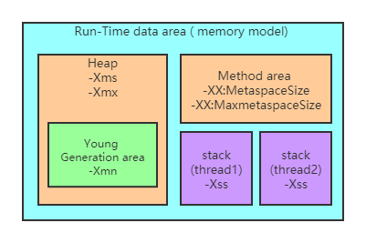
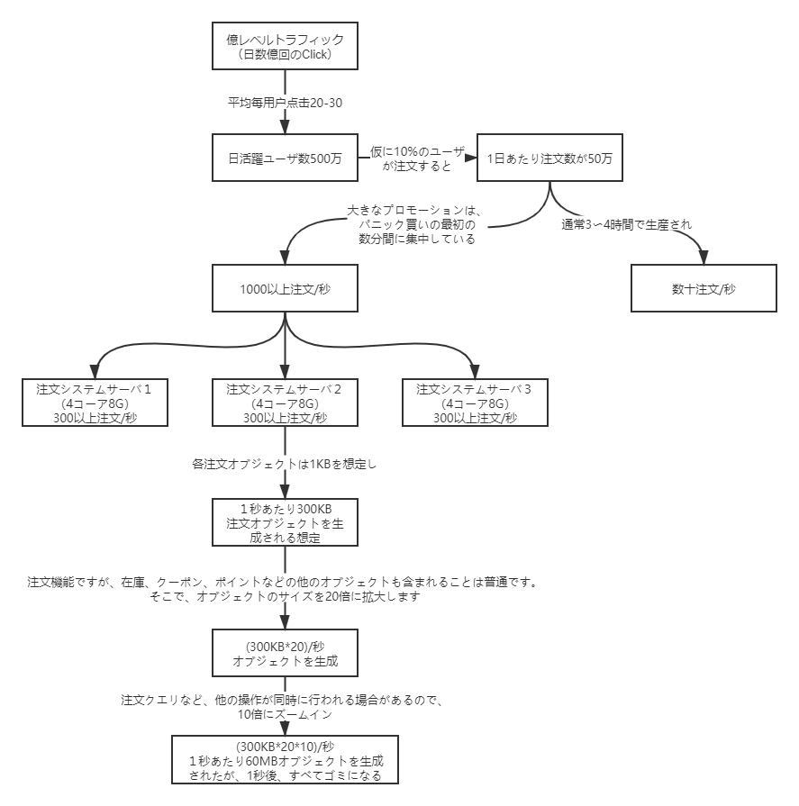

# 【経験談】1日中に注文数が百万に超える場合にJVMパラメータ設定方法（JVMパフォーマンスチューニング）

## JVMのパラメータ
**(この記事はjdk1.8を対象とすることです。)**

### ランニングデータエリア（メモリモード）



### JVMパラメータ

Spring BootプログラムのJVMパラメータ設定フォーマット（Tomcatスタートアップはbinディレクトリのcatalina.shファイルに追加されます）：

```xml
java -Xms2048M -Xmx2048M -Xmn1024M -Xss512K -XX:MetaspaceSize=256M -XX:MaxMetaspaceSize=256M -jar microservice-eureka-server.jar
```

* -Xss：スレッドあたりのスタックサイズ
* -Xms：初期ヒープサイズ、デフォルトの物理メモリの1/64
* -Xmx：最大ヒープサイズ、デフォルトの物理メモリの1/4
* -Xmn：Young generationサイズ
* -XX:NewSize：Young generationの初期サイズ
* -XX:NewRatio：デフォルトは2です。これは、Young generationサイズがOld generationの1/2、ヒープメモリ全体の1/3を占めることである。
* -XX:SurvivorRatio：デフォルトは8です。これは、survivorはEdenの1/8を占める、つまりYoung generationの1/10ということである。

メタスペースに関するJVMパラメータが「-XX:MetaspaceSize=N」と「-XX:MaxMetaspaceSize=N」２つがあります：

* -XX：MaxMetaspaceSize： メタスペースの最大値、デフォルトは-1です。制限なしということです。言い換えると、ローカルメモリサイズに限りです。

* -XX：MetaspaceSize：初めて超えたときにFullGCを発生させるしきい値となるメタスペースのサイズを指定します。単位はByte、デフォルトは約21mです。この値に達すると、FullGCがトリガーされ、メモリ回収を行います。同時に、コレクターは当該値を調整します。大量のスペースが解放された場合は、当該値を適切に減らす。少量のスペースが解放された場合は、「-XX:MaxMetaspaceSize」（設定されている場合）を超えないように、当該値を増やします。 これは、以前のバージョンのjdkの-XX：PermSizeパラメーターとは異なります。-XX：PermSizeは、「Permanent generation area」の初期容量を表します。

メタスペースのサイズを調整するにはFullGCが必要なため、これは非常にコストのかかる操作です。アプリケーションの起動時に大量のFullGCが発生したら、ほとんどは「Permanent generation」またはメタスペースのサイズの調整を行ったことです。

この状況に基づいて、一般的には、JVMパラメーターでMetaspaceSizeとMaxMetaspaceSizeを同じ値に設定し、初期値よりも大きく設定することをお勧めします。8G物理メモリを備えたサーバの場合、通常、これらの値の両方を256Mに設定します。

StackOverflowErrorのサンプル：

```java
// JVMパラメータ  -Xss128k(デフォルト 1M)
public class StackOverflowTest {
    
    static int count = 0;
    
    static void redo() {
        count++;
        redo();
    }

    public static void main(String[] args) {
        try {
            redo();
        } catch (Throwable t) {
            t.printStackTrace();
            System.out.println(count);
        }
    }
}

実行結果：
java.lang.StackOverflowError
	at com.tuling.jvm.StackOverflowTest.redo(StackOverflowTest.java:12)
	at com.tuling.jvm.StackOverflowTest.redo(StackOverflowTest.java:13)
	at com.tuling.jvm.StackOverflowTest.redo(StackOverflowTest.java:13)
   ......

```

**参考：**[10.4.1 Javaヒープおよびメタスペースのチューニング](https://software.fujitsu.com/jp/manual/manualfiles/m170006/b1ws1303/01z200/b1303-00-11-04-01.html)


### 結論

> 「-Xss」が小さいほど、count値が小さくなります。つまり、スレッドスタックに割り当てることができるスタックフレームは少なくなりますが、JVM全体で開くことができるスレッドの数は多くなります。


**JVMメモリパラメータサイズを設定するにはどうすればよいですか？**

JVMパラメータのサイズに固定された標準はありません。実際のプロジェクトの状況に応じて分析する必要があります。例を示します。

## 毎日注文数が百万に超える取引システムに対して、JVMパラメータを設定する方法

下図のような流れで考えてみよう。



そして、JVMパラメータは

```xml
java -Xms3072M -Xmx3072M -Xmn2048M -Xss1M -XX:MetaspaceSize=512M -XX:MaxMetaspaceSize=512M -jar microservice-eureka-server.jar
```

Run-Time data area は下図のようになりました。


> **結論：オブジェクトをできるだけ「Young generation」に割り当ててリサイクルし、あまりにも多くのオブジェクトが「Old generation」に入らないようにし、頻繁に回避することです。「Old generation」のガベージコレクション、および同時に、「Young generation」での頻繁なガベージコレクションを回避するのに十分なメモリサイズをシステムに提供します。**

***

上記の例の場合、「Full GCがほとんど発生しないようにしたい」なら、JVMをどうチューニングしたらよいでしょうか。

**答え：**

```xml
java -Xms3072M -Xmx3072M -Xmn2048M -Xss1M -XX:MetaspaceSize=256M -XX:MaxMetaspaceSize=256M -jar microservice-eureka-server.jar
```

***
