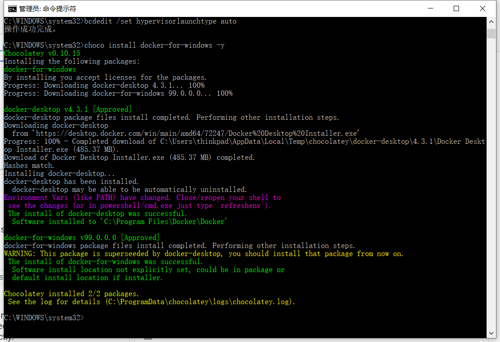
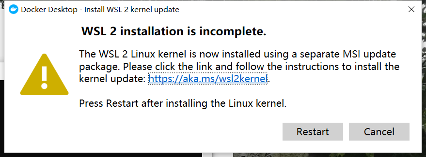
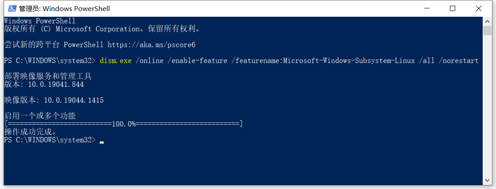

1. 开启Hyper-V

    ```
    C:\WINDOWS\system32>bcdedit /set hypervisorlaunchtype auto
    操作成功完成。
    ```

    注：关闭Hyper-V

    ```shell
    bcdedit /set hypervisorlaunchtype off
    ```

2. 安装docker-for-windows

    ```shell
    C:\WINDOWS\system32>choco install docker-for-windows -y
    Chocolatey v0.10.15
    Installing the following packages:
    docker-for-windows
    By installing you accept licenses for the packages.
    Progress: Downloading docker-desktop 4.3.1... 100%
    Progress: Downloading docker-for-windows 99.0.0.0... 100%

    docker-desktop v4.3.1 [Approved]
    docker-desktop package files install completed. Performing other installation steps.
    Downloading docker-desktop
    from 'https://desktop.docker.com/win/main/amd64/72247/Docker%20Desktop%20Installer.exe'
    Progress: 100% - Completed download of C:\Users\thinkpad\AppData\Local\Temp\chocolatey\docker-desktop\4.3.1\Docker Desktop Installer.exe (485.37 MB).
    Download of Docker Desktop Installer.exe (485.37 MB) completed.
    Hashes match.
    Installing docker-desktop...
    docker-desktop has been installed.
    docker-desktop may be able to be automatically uninstalled.
    Environment Vars (like PATH) have changed. Close/reopen your shell to
    see the changes (or in powershell/cmd.exe just type `refreshenv`).
    The install of docker-desktop was successful.
    Software installed to 'C:\Program Files\Docker\Docker'

    docker-for-windows v99.0.0.0 [Approved]
    docker-for-windows package files install completed. Performing other installation steps.
    WARNING: This package is superseeded by docker-desktop, you should install that package from now on.
    The install of docker-for-windows was successful.
    Software install location not explicitly set, could be in package or
    default install location if installer.

    Chocolatey installed 2/2 packages.
    See the log for details (C:\ProgramData\chocolatey\logs\chocolatey.log).

    C:\WINDOWS\system32>
    ```

    

3. 重启

4. 但如何知道Docker已经跑起来了呢？

    ```shell
    docker ps
    ```


ERROR: WSL 2 installation is incomplete




Docker Desktop - Install WLS 2 kernel update

```shell
dism.exe /online /enable-feature /featurename:Microsoft-Windows-Subsystem-Linux /all /norestart
```
[以前のバージョンの WSL の手動インストール手順](https://docs.microsoft.com/ja-jp/windows/wsl/install-manual#step-4---download-the-linux-kernel-update-package)

```
Windows PowerShell
版权所有 (C) Microsoft Corporation。保留所有权利。

尝试新的跨平台 PowerShell https://aka.ms/pscore6

PS C:\WINDOWS\system32> dism.exe /online /enable-feature /featurename:Microsoft-Windows-Subsystem-Linux /all /norestart

部署映像服务和管理工具
版本: 10.0.19041.844

映像版本: 10.0.19044.1415

启用一个或多个功能
[==========================100.0%==========================]
操作成功完成。
PS C:\WINDOWS\system32>
```

