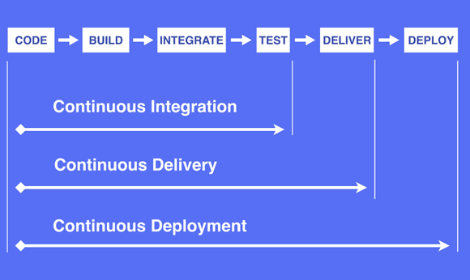
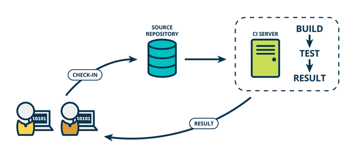
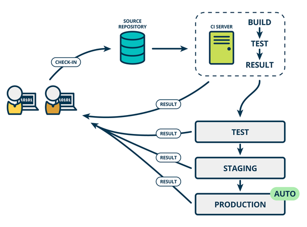
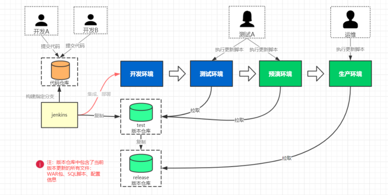
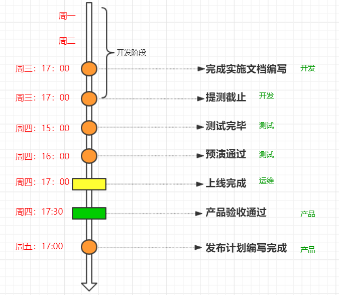
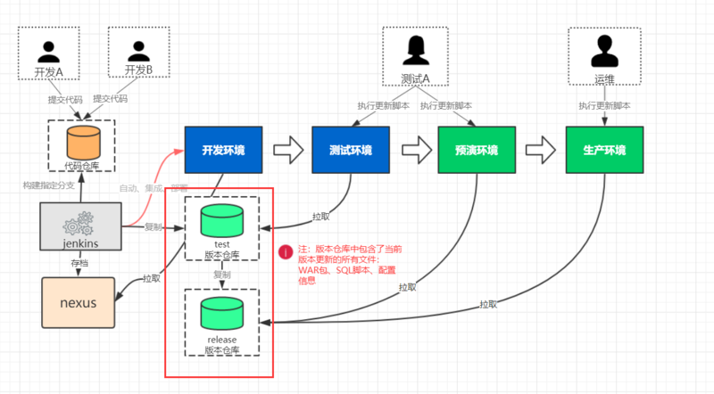
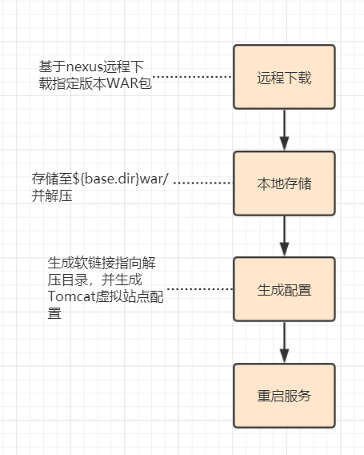
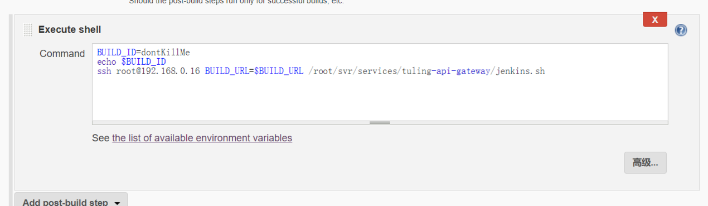
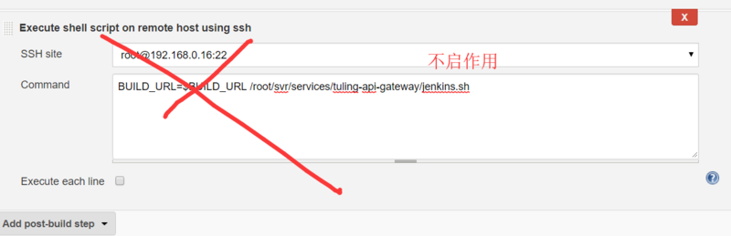
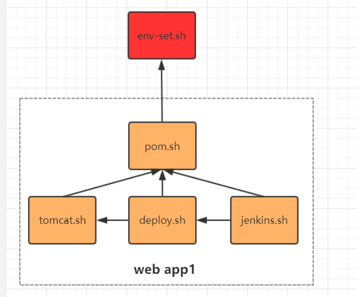

# 概要：
1.	持续发布版本所面临的问题
2.	版本快速迭代流程设计
3.	集成部署环境构建

# 一、持续发布版本所面临的问题

提问：
1.	现在所在的公司是如何发布版本的?多久发布一次？
2.	已什么样的形式进行发布？
3.	有没有出现过发布事故？

增量发布?
修改的 Class 直接丢给甲方 工程师

**产品迭代过程**

一般情况下产品迭代发布过程分为以下几个阶段：
编码 -> 构建 -> 集成 -> 测试 -> 交付 -> 部署 ，但随着敏捷开发模式与微服务架构的盛行，导致整个链路实施过程变得越来越复杂沉重，迭代周期脱长。 为了解决这一问题大牛们分别提出了,持续集成、技术交互、技术部署的概念，经证实这是一个行之有效的方式，但同时也对团队的技能水平提出了过分的要求，所以说现在并没有完全运用起来，未来的技术发展趋势整体是朝这个方向走的。现在我们就先来认识一下，持续集成、交互、部署的概念很有必要。

 


**持续集成（continuous INTEGRATE）：**  
持续集成是指软件个人研发的部分向软件整体部分交付，频繁进行集成以便更快地发现其中的错误。
  

持续交付（continuous DELIVER）
持续交付在持续集成的基础上，将集成后的代码部署到更贴近真实运行环境的,预演境。

持续部署 (continuous deployment )
持续部署则是在持续交付的基础上，把部署到生产环境的过程自动化。

  


企业如何做到持续集成、交互、部署呢？正如网络流行语：“这个问题充钱就能解决”，大量的私有云厂商通过容器化技术已经打通整条链路：无论是自动化测试、持续集成、持续交付、自动化部署都有较成熟的解决方案。
如果企业不愿意购买现成的解决方案，那就只能自己动来实践，当然这个摸索过程会长一些，但也会更贴近企业的实际环境。接下来我们要讲的是一个真实的企业产品集成部署解决方案。（注：不一定完全适合你们企业，但借鉴下总是可以的）

# 二、 版本快速迭代流程设计

知识点：
1.	整体流程设计
2.	发布窗口机制
3.	发布计划与实施计划
4.	时间节点

开发环境===> 测试环境  ==》预演环境   ==》 生产环境

## 1、整体流程设计
   

## 2、发布窗口机制
上述的发布流程还是比较重的，我们不可能每天走一遍。可以设定一个固定的发布时间，一般是设在周四。下午4点准时发布，如果这个点还没有来得及实现或测试的需求，则需要到下一下个窗口才能发布。这样做的目的是为了让团队中每个人清晰有一个时间概念，知道什么时候该干什么事，避免手脚乱的随意发布上线。

## 3、发布计划
很多的时候我们跌代的需求之间是有依赖关系，还有需求的工作量也不一样，有的下个窗口就能完成，有的则需要更长时间，为此我们需要提前计划好下个窗口能上线的需求，避免A需求发布时，他所依赖的B需求确不能发布的情况发生，或者中间随意添加需求，从而让发布变得难以控制。  
通常我们会在周五前由产品经或测试与开发协商后制定下个窗口期的发布计划表。包含以下内容  

| 需求说明	| 需求编号	| 应用系统	| 开发负责人	| 测试负责人	| 对应版本号 |
|---|---|---|---|---|---|
|---|---|---|---|---|---|

					
## 4、实施计划
有了发布计划 并不意味着我们就可以拿着计划更新上线了，到了发布时间计划的项目不一定能够如期实现，更重要的是发布计划中并不没有包含实施更新说明如：需要更新哪些SQL脚本哪些配置文件等。而这些都是测试人员在更新环境的时候所必要的。所以在发布之前需要开发人员填写一个部署说明文档其包含如下内容:

需求说明、需求编号、应用系统、依赖系统、项目文件、变更脚本、变更配置、开发负责人、测试负责人、版本编号、发布时间。  一般由各个开发来共同编写这个文档。所以我们需要可以在线共同协作的文本编辑系统来实现。而不是采用桌面软件来编辑。目前有很多这类的文档系统如：石默、有道云、腾讯文档等。当然你们企业可能禁止访问公网，或者对信息安全非常敏感那这时我们需要安装购买：confluence这类的协同软件。

## 5、时间节点
整个过程涉及多方团队协作，只要一方延误，就会造成其它方 等待或工作推迟的情况发生。比如开发的A需求延迟半天提测就这会导致测试的工作会延尽、从而影响上线时间。为避免这种情况我们需要设计精细的时间节点如下：

  

# 三、集成部署环境构建
知识点：
1.	版本仓库选型
2.	更新机制实现（更新脚本、jenkins配置）
- a.	项目更新
- b.	配置文件更新
- c.	版本回滚
- d.	适应不同环境（开发、测试、运维）

## 1、版本仓库选型
  

我在我们设计的整个流程当中版本仓库是非常重要的一项，他用于存储版本发布所需 程序包、更新脚本、更新配置。这里我们直接采用SVN实现。为什么不采用nexus 或git 呢？因为nexus 不能存储更新脚本和配置文件，而git对于测试人员和运维人员使用稍复杂，此外版本仓库只是单纯的存储，git的特性发挥不出来。

注：下面特整里了SVN的安装方法，但这不是本课的重点。

SVN 服务搭建-----------------------------------------------------------------------------------------------
SVN服务安装

```shell
#yum 安装 
yum install subversion
#查看svnserver版本
svnversion --version
创建SVN版本目录
mkdir -p /data/svn/repository
svnadmin create /data/svn/repository
SVN配置
配置目录：  /data/svn/repository/conf
authz :目录权限设置
vim authz
#表示添加一个admin帐号，密码为 admin123
admin=admin123
passwd：用户与密码设置
vim passwd
#表示admin 拥有所有目录的读写权限
[/]
admin=rw
svnserve.conf ：svn服务
vim svnserve.conf 
anon-access = read
auth-access = write
password-db = passwd
authz-db = authz
realm = /data/svn/repository
启动svn 服务
svnserve -d -r /var/svn/svnrepos
基于客户端访问svn 
默认端口：3690
地址：svn://192.168.17.200:3690/
end------------------------------------------------------------------------------------------------------------
```

## 2、更新机制实现
更新机制是指项目如何进行实质的更新，图中我们充计了两种方式：一种是自动推送，另外一种是手动拉取。前者用于开发环境、后者可以用于所有环境。


手动拉取
拉取更新流程如下：
  

上述流程是由自己编写的一个 deploy.sh 脚本实现：

```shell
#!/bin/bash -e
cd "`dirname $0`"
. ./pom.sh

#1. download war, ready env
echo "deploy time: $work_time"
mkdir -p war/
war=war/$pom_a-$pom_v.war
download_path="$nexus_redirect?r=$pom_r&g=$pom_g&a=$pom_a&v=$pom_v&e=war"
wget  $download_path -O $war

deploy_war() {
        target_d=war/${pom_a}-${pom_v}-$work_time
        target_dir=`pwd`/$target_d
        if [ ! -f "$war" ]; then
                echo "war not exist: $war"
                exit 1
        fi
        unzip -q $war -d $target_dir
        cp -r app-conf/* $target_dir/WEB-INF/classes/
        rm -rf appwar
        ln -sf $target_d appwar

        ./tomcat.sh stop

        target_ln=`pwd`/appwar
        echo '<?xml version="1.0" encoding="UTF-8" ?>
<Context docBase="'$target_ln'" allowLinking="true">
</Context>' > conf/Catalina/localhost/ROOT.xml
        ./tomcat.sh start
}

deploy_war
```

注：在上述deploy.sh 脚本中还用到了 pom.sh 与tomcat.sh 其作用后续在做说明。
在测试环境、预演环境还有生产环境的时候 ，我们是不会直接从nexus 中下载的，而是特定的版本库。这时只需要修改 $download_path  参数即可。

自动推送：

自动推送方式采用在jenkins 构建完成之后，执行远程sh 脚本 用于下载本次构建WAR包，在自动部署重启。基jenkins 配置如下：
 
 
 注：前提条件是 jenkins 服务要在业务服务器上做免密登录。  
此处只能用 Execute shell 而不用能用：Execute shell script on remote host using ssh ，因为BUILD_ID=dontKillMe 不会被修改 ，而是当作参数来传递
  

${BUILD_URL} 是一个隐示参数，表示本次构建的URL。
jenkins.sh 是放置在应用目录下的一个脚本：

```shell
#!/bin/bash -e
cd "`dirname $0`"
. ./pom.sh


#1. download war, ready env
echo "deploy time: $work_time"
mkdir -p war/
# 配置下载存放目录
war=war/$pom_a-$pom_v.war
# 基于远程传过来的 BUILD_URL下载本次构建
wget  "${BUILD_URL}${pom_g}\$${pom_a}/artifact/$pom_g/$pom_a/$pom_v/$pom_a-$pom_v.war" -O $war
# 执行部署函数
deploy_war
```

配置文件更新：  
我们在跌代的过程当中总共 要经过四个环境，每个环境的配置信息是不一样的，如何在更新项目的时候把对应的配置文件也更新了呢? 有在有一种做法是 采用 Disconf 之类的配置系统来管理各个环境 的配置，但这里我们采用的是一个简单些的方案: 把当前环境 的配置文件放到 app-conf 目录下，等更新脚本的时候会一同覆盖原来的配置文件。 

版本回滚：  
之前在部署的时候是通过软链接的形式指向指定程序目录，而且原历史版本不会删除，回滚的时候只要把原软软链接 指定历史程序目录即可。而且配置文件也会一同回滚。

更新脚本说明：  
前面说过deploy.sh 部署脚本中还用到了 pom.sh 与tomcat.sh 等脚本，这些脚本的作用是什么呢？整体逻辑如下依赖关系如下:

 

  说明：

-	env-set.sh : 设置jvm 、Tomcat 等环境参数
-	pom.sh: 设置当前项目的 groupid 、artifact、version 信息
-	tomcat.sh：启动关闭Tomcat
-	deploy.sh :  下载并部署项目
-	jenkins.sh:  用于被jenkins 远程触发下载指定更新版本  

注：以上脚本分别存储至 env-set.sh  与 Tomcat-deomo.zip 附件中,也可在相关课件目录中去获取


[!部署脚本与目录文件.zip](./resouces/001.zip)

版本分支管理

***