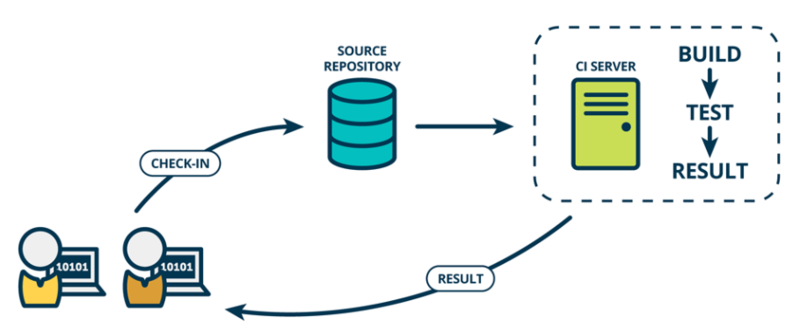
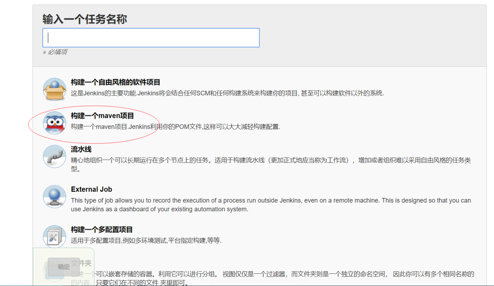
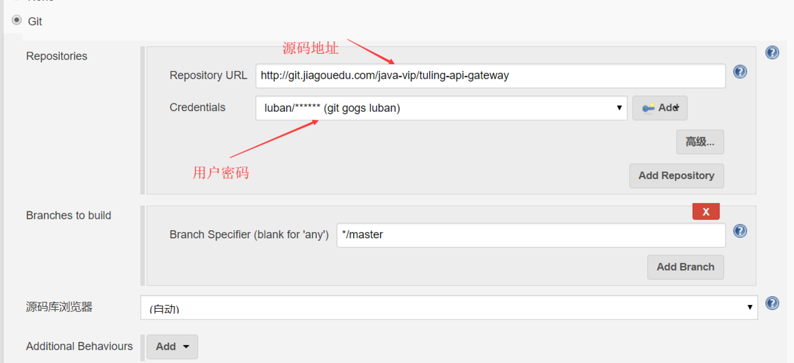
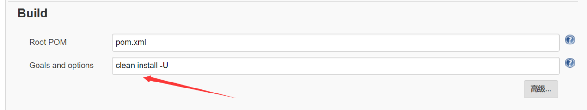
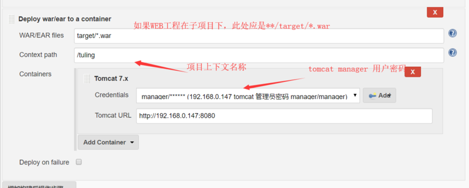
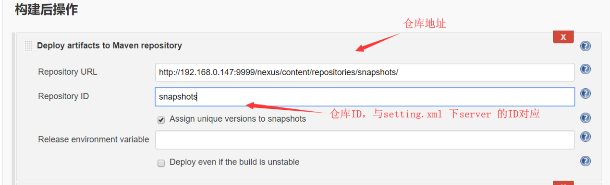
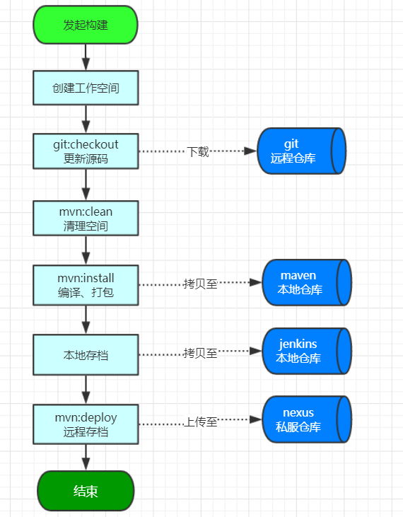

# 目录：
1. jenkins 概述与环境配置
1. 基于jenkins 实现可持续化集成
2. jenkins pipeline 核心应用


# 一、jenkins 概述与环境配置
知识点：
1. 关于可持续化集成 （CI）
2. jenkins 概述
3. 下载安装jenkins 
4. 基础环境配置与常用插件下载

## 1、关于可持续化集成
相信大家都知道jenkins是用来做可持续集成的? 但部问题是很多人并不明白什么叫可持续化集成。讲概念之前我们先来举一个场景：
一个团队正着手开发一个项目，在需求评审之后由小组长把项目拆成了若干个模块，分给不同的小伙伴去实现。2个星期以后各自模块的功能都实现了，大家都很开心。这时该合在一起提测了吧。这一合小组长傻眼了，功能没一个能用的，要么公共类冲突了，要么配置冲突....
经过上次的教训，小组长变聪明了，在也不等功能开发之后在合并提测了，而是每天集成提测，如果发现冲突当天就要解决。

持续集成即 Continuous integration（CI） 是一种软件开发实践，即团队开发成员经常集成他们的工作，每次集成都通过自动化的构建（包括编译，发布，自动化测试）来验证，从而尽快地发现集成错误，让团队能够更高效的开发软件。

 

持续集成要点：
-	统一的代码库(git)
-	统一的依赖包管理(nexus)
-	测试自动化
-	构建全自动化(maven)
-	部署自动化
-	可追踪的集成记录

## 2、jenkins 概述
jenkins 就是为了满足上述持续集成的要点而设计的一款工具，其主体框架采用JAVA开发，实质内部功能都是由各种插件实现，极大提高了系统的扩展性。其不仅可以满足JAVA系统的集成，也可以实现PHP等语言的集成发布。通过其pipeline 插件，用户可以随自己需要定制集成流程。

## 2、下载安装jenkins 
下载：jenkins 支持Docker、yum、msi 等安装，在这里推荐大家直接选择下载他对应的WAR包进行安装。https://jenkins.io/download/
启动：下载完成之后直接可通过 jar -jar 命令启动
java -jar jenkins.war --httpPort=8080
也可以将其放至到servlet容器（tomcat\jetty\jboss）中直接启动，无需过多的配置，一切插件化这是jenkins 比较优秀的设计。

配置：下载完成之后进入启动页(http://127.0.0.1:8080/) 会有一个 验证过程，验证码存储在 ${user_home}\.jenkins\secrets\initialAdminPassword 中，接着就是进入安装插件页，选择默认即可，这个过程稍长。

## 3、基础环境配置与常用插件下载
在集成的时候,jenkins 用到了 Maven 、Git  所以服务器中必须提前安装好这些环境，具体参照前面的git与maven 课程。

插件下载
更换源 ->系统管理->管理插件->高级 ->升级站点
把：http://updates.jenkins-ci.org/update-center.json 
换成：http://mirror.esuni.jp/jenkins/updates/update-center.json 
镜像源查询：http://mirrors.jenkins-ci.org/status.html

基本插件列表
插件名称	插件描述
Maven Integration 	maven 管理插件
Deploy to container	容器部署插件
Pipeline	管道集成插件
Email Extension  	邮件通知插件
SSH	用于ssh 通信


# 二、基于jenkins 实现可持续化集成
知识点：
1. 持续化集成完成的目标
2. 持续化集成配置
3. 集成实现原理

## 1、 持续化集成完成的目标
需要到达的目标如下：
1. 自动基于分支构建项目
2. 构建好的项目自动部署至Tomcat容器
3. 构建好的项目自动上传至Nexus 私服存档
4. 保存构建历史记录，并可以下载历史记录

## 2、持续化集成配置

### 1.	 新建maven job
  
### 2.	配置checkout 源码
  
### 3.	 编写 maven构建 命令
  
### 4.	 自动部署至Tomcat配置
添加构建后操作：Deploy war/ear to container 项目
  

自动部署的前提条件：
1. 需要下载 Deploy to container 插件
2. 设置Tomcat manager 用户和密码，以下配置加入至 Tomcat conf/  
  tomcat-users.xml 中

3. tomcat webapp  中必须保留 manager 项目

```xml
<role rolename="admin-gui"/>
<role rolename="manager-gui"/>
<role rolename="manager-script"/>
<user username="manager" password="manager" roles="manager-gui,manager-script"/>
<user username="admin" password="admin" roles="admin-gui,manager-gui"/>
```

### 5.	 存档配置
构建后操作添加 Deploy war/ear to a container 项目
  

配置setting.xml 用于获取上传至nexus 的权限
vim ~/.m2/settings.xml
# 添加一个 server  id 与 存档配置当中的repository id 相对应。

```xml
 <server>
          <id>nexusReleases</id>
          <username>deployment</username>
          <password>111111</password>
</server>
```

## 3、集成实现原理
 
 

# 三、jenkins pipeline 核心应用
知识点：
1. pipeline 概要
2. pipeline 基础语法
3. pipeline Demo演示

## 1、pipeline 概要
前面我们演示的 使用maven 来进行自动化构建，其流程分别是：构建环境准备==》源码下载 ==》构建 ==》存档 ==》部署。这是一种固化的构建流程，如果你们的需求是多个项目需要进行依赖构建这种复杂的构建场景 时该怎么办？jenkins pipeline 可以做到这一点。
   Jenkins从根本上讲是一种支持多种自动化模式的自动化引擎。Pipeline在Jenkins上添加了一套强大的自动化工具，支持从简单的连续集成到全面的连续输送Pipeline的用例。用户可以基于他实现更为复杂的建模场景。

## 2、pipeline 基础语法
以下就是一个非常简单的 pipeline 脚本：

```pipeline
pipeline {
    agent any 
    stages {
        stage('Build') { 
            steps { 
                sh 'make' 
            }
        }
        stage('Test'){
            steps {
                sh 'make check'
                junit 'reports/**/*.xml' 
            }
        }
        stage('Deploy') {
            steps {
                sh 'make publish'
            }
        }
    }
}
```

agent  表示Jenkins应该为Pipeline的这一部分分配一个执行者和工作区。
stage  描述了这条Pipeline的一个阶段。
steps  描述了要在其中运行的步骤 stage
sh      执行给定的shell命令
junit   是由JUnit插件提供的 用于聚合测试报告的Pipeline步骤。

## 3、pipeline Demo演示
前提条件
1.	Jenkins 2.x或更高版本
2.	Pipeline插件

可以通过以下任一方式创建基本Pipeline：

1.	直接在Jenkins网页界面中输入脚本。
2.	通过创建一个Jenkinsfile可以检入项目的源代码管理库。  
用任一方法定义Pipeline的语法是一样的，从项目源码中检入jenkinsfile 文件会更方便一些。


基于脚本构建 pipeline

```
pipeline {
    agent any
    stages {
        stage('Checkout') {
            steps {
                echo 'Checkout'
        stage('Build') {
            steps {
                echo 'Building'
            }
        }
        stage('test'){
            steps{
                echo 'test'
            }
        }
    }
}
```

基于Jenkinsfile 构建
```
pipeline {
    agent any 
    stages {
        stage('checkout') { 
            steps { 
                echo 'checkout' 
                checkout([$class: 'GitSCM', branches: [[name: '*/master']], doGenerateSubmoduleConfigurations: false, extensions: [], submoduleCfg: [], userRemoteConfigs: [[credentialsId: 'gogs_luban', url: 'http://git.jiagouedu.com/java-vip/tuling-api-gateway']]])
            }
        }
        stage('build'){
            steps {
                 echo 'build'
                 sh 'mvn clean install'
            }
        }
        stage('save') {
            steps {
               echo 'save'
               archiveArtifacts 'target/*.war'
            }
        }
    }
}
```

***